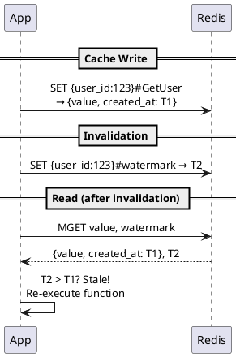

# Caching Without the Chaos

> Shipping performance fixes safely

---

You shipped fast. Your team prioritized features over optimizations, and that was the right call—you found product-market fit, landed customers, and kept the lights on. But now your endpoints are slow. You've got N+1 queries hiding in your API handlers, repeated calls to the same external services, and p99 latencies that make your SRE team nervous.

One option is to refactor your I/O patterns—batch those database calls, deduplicate those API requests. But that's a multi-sprint project, and it's hard to prioritize over the feature roadmap.

You need to add caching to your existing code, not rewrite it. But caching comes with its own risks—inconsistent key patterns across the codebase, stale data bugs that are hard to reproduce, no visibility into what's actually being cached, and invalidation logic scattered everywhere. Without guardrails, caching can quickly become its own maintenance nightmare.

At Galileo, we hit this exact problem. We were shipping fast, performance issues piled up, and we needed a way to add caching incrementally without the usual risks. This isn't the first time I've tackled this—I [previously built a similar library at DoorDash](https://careersatdoordash.com/blog/how-doordash-standardized-and-improved-microservices-caching/) for their Kotlin microservices. gcache applies the same proven patterns to Python, as an opinionated wrapper around standard caching tools (Redis, cachetools) that adds the guardrails we needed.

Adding gcache to our API key verification cut p50 latency by 50%.

## What Makes gcache Different

[gcache](https://github.com/rungalileo/gcache):

- **Caching is off by default** — you explicitly enable it where it's safe
- **Gradual rollout with runtime kill switch** — no redeploy to dial back
- **Built-in Prometheus metrics** — hit rates, miss reasons, latencies per cache layer and use case
- **O(1) entity invalidation** — one call invalidates all caches for a user, org, or any entity—no scanning
- **Multi-layer read-through cache** — local in-memory + Redis, reducing load on your distributed cache
- **Fail-open design** — cache errors are logged and emitted as metrics, never thrown

## Why "Just Add Caching" Is Scary

"There are only two hard things in computer science: cache invalidation and naming things." Caching is deceptively easy to add and genuinely hard to get right.

The worst part: **cache bugs are invisible**. When something goes wrong, caching is rarely your first suspect. You're digging through database queries, checking API responses, reviewing business logic—and hours later you realize a stale cache entry was the culprit. Cache bugs are intermittent, timing-dependent, and leave no obvious trail. This makes every other caching problem worse.

**Stale data bugs.** You cache a database read. A moment later, a write updates that data. Now you're serving stale data until the TTL expires—or forever, if you forgot to invalidate. These bugs are subtle, hard to reproduce, and erode user trust.

**No visibility.** Is caching even working? What's the hit rate? You added caching to that slow endpoint three months ago, but you have no idea if it's actually helping or just adding complexity.

**All-or-nothing deployment.** You ship caching to production and watch closely. If something breaks, you're looking at a hotfix deploy to disable it.

**Configuration requires redeploy.** Found a caching bug? You need to push a config change through your entire CI/CD pipeline just to turn it off—often at the worst possible time.

**Invalidation hell.**

Your user updates their profile. Now you need to invalidate their cached data. But where is it cached?

`user_123`? `user:123:profile`? `getUserPosts_123`?

That function another engineer added last sprint—what key pattern did they use?

You grep the codebase, find 6 different caching calls for user data, manually construct each cache key, and invalidate them one by one—hoping you found them all. Inevitably, you miss one, and there's a stale data bug in production until someone notices.

This is especially painful for fast-moving teams because caching gets added incrementally by different engineers over months. Without structure, the mess compounds.

## gcache's Approach: Caching With Guardrails

gcache's core philosophy: make caching safe to add incrementally to production systems.

### Explicit Enable (Safety by Default)

Most caching libraries are "always on"—decorate a function, and it starts caching immediately. This is dangerous because it's easy to accidentally cache in write paths.

gcache flips this. Caching is OFF by default:

```python
@gcache.cached(key_type="user_id", id_arg="user_id", use_case="GetUser")
async def get_user(user_id: str) -> dict:
    return await db.fetch_user(user_id)

# Caching OFF - function always executes fresh
result = await get_user("123")

# Caching ON - explicitly enabled for this code path
with gcache.enable():
    result = await get_user("123")
```

This forces you to consciously decide where caching is safe. Read-heavy API endpoints? Enable caching. Write paths where you're about to mutate data? Leave it disabled. The decorator marks *what* can be cached; the `enable()` context marks *where* it's safe to use the cache.

### Gradual Rollout (Ramping)

Shipping caching shouldn't be an all-or-nothing bet. gcache lets you ramp up gradually:

```python
# Start cautious - only 10% of requests use the cache
config = GCacheKeyConfig(
    ttl_sec={CacheLayer.LOCAL: 60, CacheLayer.REMOTE: 300},
    ramp={CacheLayer.LOCAL: 10, CacheLayer.REMOTE: 10}
)
```

The `ramp` parameter controls what percentage of requests use the cache. Start at 10%, watch your metrics, and dial up to 100% as you gain confidence.

More importantly, this is controlled via a runtime config provider—not hardcoded values:

```python
async def config_provider(key: GCacheKey) -> GCacheKeyConfig | None:
    # Fetch config from your config service, database, feature flags, etc.
    return await config_service.get_cache_config(key.use_case)

gcache = GCache(GCacheConfig(cache_config_provider=config_provider))
```

The config provider implementation is up to you—it could be a database lookup, a feature flag service, a config file, or anything else that returns cache settings at runtime.

Found a bug? Set the ramp to 0% in your config service and it takes effect immediately—no redeploy required.

### Structured Keys & O(1) Invalidation

gcache enforces a consistent cache key structure using URN format:

```
urn:prefix:user_id:123?page=1&sort=recent#GetUserPosts
```

Every cache key follows this pattern:
- `key_type` (e.g., `user_id`) — what entity is this cache about?
- `id` (e.g., `123`) — which specific entity?
- `args` — other function arguments that affect the result
- `use_case` (e.g., `GetUserPosts`) — which caching scenario?

This isn't just for aesthetics. The structure enables targeted invalidation:

```python
# User updates their profile
await gcache.ainvalidate(key_type="user_id", id="12345")
```

That single call invalidates *all* cached data for user 12345—`GetUser`, `GetUserPosts`, `GetUserSettings`, everything. No more grepping the codebase for cache keys. No more hoping you found them all.

**How it works under the hood:** Most caching libraries handle invalidation by scanning for matching keys and deleting them. This is O(n)—the more cached entries, the slower invalidation gets. gcache uses a different approach: **watermarks**.

When you call `ainvalidate()`, gcache doesn't hunt for keys to delete. Instead, it writes a single watermark key with the current timestamp:

```
{user_id:123}#watermark → 1706547200000
```

On every cache read, gcache fetches both the cached value and its watermark in one Redis call. Every cached value stores a `created_at` timestamp. If the watermark is newer than the cached value, the cache is considered stale—the function re-executes and the result is re-cached.



This design has key advantages:

- **O(1) invalidation** — One Redis write, regardless of how many entries exist for that entity
- **No scanning** — Works at scale without performance degradation
- **Atomic reads** — Value and watermark fetched together, no race conditions
- **Redis Cluster compatible** — No cross-shard coordination needed

Note: invalidation applies to the Redis layer. Local in-memory caches expire via TTL. For data where staleness after writes is unacceptable, configure local caching with a short TTL or disable it entirely.

An added benefit: when you're debugging and need to inspect Redis directly, the keys are human-readable. You can immediately see what entity a cache entry belongs to and which code path created it.

### Built-in Observability

gcache exports Prometheus metrics out of the box:

- `gcache_request_counter` — total cache requests by use_case, key_type, layer
- `gcache_miss_counter` — cache misses
- `gcache_disabled_counter` — cached function calls that skipped caching (with reason: context not enabled, ramped down, config error)
- `gcache_error_counter` — errors during cache operations
- `gcache_get_timer` — cache lookup latency
- `gcache_fallback_timer` — time spent executing the underlying function

You can answer questions like:
- What's the hit rate for `GetUser`?
- Is the local cache actually helping, or is everything going to Redis?
- Why is caching disabled for 30% of requests?

![TODO: Add Grafana screenshot showing gcache dashboard - cache request rate, hit rate, etc.]

No additional instrumentation required.

### Multi-Layer Read-Through Cache

Why not just use Redis? Network round trips add latency, even to a fast cache. For data that's read repeatedly within a short window—authentication tokens, feature flags, configuration—hitting Redis on every call is wasteful.

gcache uses a two-layer architecture: a local in-memory cache (per-instance) backed by Redis (shared across your fleet).

On a cache read:
1. Check local cache → hit? Return immediately
2. Check Redis → hit? Populate local cache, return
3. Miss? Execute function, populate both layers, return

![TODO: Add architecture diagram showing App → Local Cache → Redis → DB flow with hit/miss paths]

This reduces load on Redis significantly. Most repeated reads within a short window hit the local cache and never touch the network. You can configure TTLs and ramp percentages independently for each layer—aggressive local caching with conservative Redis caching, or vice versa.

### Fail-Open Design

Caching should improve your system, not become a new failure mode. gcache is fail-open: if Redis is down or a cache operation fails, the underlying function executes normally. Your app gets slower, not broken. Errors are logged and emitted as Prometheus metrics (`gcache_error_counter`), so you'll know something's wrong—but your users won't see errors.

## Before/After: Caching API Key Verification at Galileo

One of our highest-traffic endpoints is `/protect/invoke`, part of one of our core product offerings that provides real-time guardrails for AI applications. We noticed latency creeping up and used our function metrics dashboard to find the bottleneck.

The culprit: API key verification. Every request authenticates via API key, which involves a database lookup and bcrypt verification. This was adding significant latency to every request.

The fix was a 3-line diff: adding the `@gcache.cached` decorator to the lookup function. We configured a 5-second local TTL and 10-second Redis TTL via our runtime config service, then ramped the cache from 0% to 100%.

**Results:**
- **50%+ improvement** in p50 and p75 latency
- **~10% improvement** in p95 and p99 latency
- **40% reduction** in CPU usage across API pods

![TODO: Add Grafana screenshot showing latency comparison - cache enabled (left) vs cache disabled (right)]

To validate these results weren't noise, we ramped the cache back down to 0%—latency immediately returned to previous levels. This confirmed the improvement was real and gave us confidence to leave caching enabled.

We've since applied the same pattern to other hot paths: user lookup by email (10-15% latency improvement), stage configuration loading (7% RPS boost), and authorization checks. Each followed the same process: identify the bottleneck, add the decorator, ramp gradually, measure.

The key insight wasn't just the performance gains—it was how quickly we could ship and validate caching changes without redeploying. When you can ramp a cache from 0% to 100% (or back) via a config change, experimentation becomes low-risk.

## When to Use gcache (and When Not To)

**Good fit:**
- Existing codebase with performance issues you need to fix without a rewrite
- Team that ships fast and adds caching incrementally over time
- Production systems where you need runtime control and observability
- Python async or sync codebases

**Not the right tool:**
- Simple scripts or CLIs where caching complexity isn't worth it
- Cases where services don't share a Redis instance (invalidation doesn't broadcast across separate Redis clusters)

**How you configure depends on staleness tolerance:**
- **Can tolerate minutes of staleness** — use both local and Redis layers with longer TTLs
- **Need near-real-time consistency** — disable local caching, use shorter Redis TTLs, call `ainvalidate()` on writes

## Getting Started

```bash
pip install gcache
```

```python
from gcache import GCache, GCacheConfig

gcache = GCache(GCacheConfig())

@gcache.cached(key_type="org_id", id_arg="org_id", use_case="GetOrgSettings")
async def get_org_settings(org_id: str) -> dict:
    return await db.fetch_org_settings(org_id)
```

See the [GitHub repository](https://github.com/rungalileo/gcache) for full documentation and configuration examples. Contributions and feedback welcome.

---

gcache is running in production at Galileo across multiple services, handling authentication, authorization, and configuration lookups. If you're dealing with similar performance challenges, give it a try—and let us know how it goes.

---

## Writing Constraints (LLM Instructions)

This section captures the voice, tone, and style constraints for this article. Use these as guardrails when editing or extending the draft.

### Voice & Tone

**Target voice:** Blog post by a seasoned staff+ engineer who created a solution with a proven track record for high velocity product engineering teams.

**Characteristics:**
- Confident but not arrogant — states things directly without hedging or trying to be clever
- Experiential — shares what we learned, not opinions ("we found that..." not "I think...")
- Respects the reader's time — no filler, no buildup for punchlines
- Honest about tradeoffs — includes limitations, doesn't oversell
- Lets the solution speak for itself — describes what it does, trusts the reader to see the value

**Avoid:**
- Cheeky/snarky humor (e.g., "pray you didn't miss any. You did.")
- Dramatic fragments for effect (e.g., "At 3am. On a Friday.")
- Meme-style code comments (e.g., "Oh no, roll back NOW")
- Salesy language or hype
- Condescending explanations
- Marketing-speak (e.g., "invalidation that actually works", "caching done right", "the only caching library you'll ever need") — this is an engineering blog, describe what it does and let readers judge the value

**Okay to include:**
- Well-known references like the cache invalidation quote (used straight, not as a joke)
- Concrete narratives from experience (the invalidation hell story)
- Light moments that arise naturally, but not forced humor

### Positioning

- gcache is positioned for **high velocity product engineering teams** that need to add caching to existing code without refactoring
- Key differentiators: safety by default, runtime control, structured keys for invalidation, built-in observability, multi-layer read-through architecture
- Origin story: built at Galileo to solve real performance problems

### Audience

- Senior engineers and engineering team leads
- People who have been burned by caching before
- Teams that ship fast and need pragmatic solutions

### Structure Notes

- Open with the problem (shipped fast, now slow)
- Teaser section gives the 6 key differentiators upfront for skimmers
- "Why caching is scary" validates the hesitation before presenting the solution
- Before/after section is the emotional hook — uses real API key caching example with concrete metrics
- Code examples should be copy-pasteable
