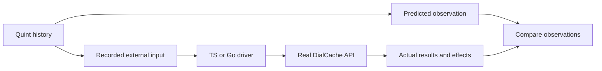

# Follow one behavior from Quint to both ports

Start with [`heldPolicyDoesNotSpendSourceBudgetTest`](./dialcache-source-budgets-conformance.qnt)
in `dialcache_source_budgets_conformance`. It is a short example of the portable
rule that waiting for runtime policy leaves the source's later deadline intact.
The stable contract is **C23**; this particular case is
**C23.policy-does-not-spend-source-budget**. Keep those IDs when refining the
same rule so its documentation, model and implementation evidence stay connected.

This page is a navigation aid for that existing rule. The model defines the
transition; [SPEC.md](./SPEC.md#time-source-acceptance-and-progress) supplies its
surrounding time and progress contract.

## Read the named run first

Open [dialcache-source-budgets-conformance.qnt](./dialcache-source-budgets-conformance.qnt)
and find `heldPolicyDoesNotSpendSourceBudgetTest`. It initializes
`FINITE_BUDGET_MODE`, whose source budget is 10 ms, then follows this history:

| Model step | Meaning | What distinguishes correct behavior |
| --- | --- | --- |
| `begin(ENABLED)` | Begin one enabled call; hold its runtime-policy reply | The call is pending and no source has started |
| `advanced(100)` | Let 100 ms pass while policy is held | Still no source execution or source timeout |
| `release(0)` | Release that policy reply | The source starts now, with its own full budget |
| `advanced(9)` then `resolved(0, VALUE_ONE)` | Complete the source 9 ms after its start | The call returns `VALUE_ONE` |
| `begin(ENABLED)` then `release(1)` | Call the same local key again | It reuses `VALUE_ONE`; total source executions remain one |

A timer incorrectly charged for the earlier policy wait would disagree with
this history. The final reuse probe also checks publication through the real
cache path; obtaining a value once is not the whole consequence.

Read these definitions next, in this order:

1. `initialize` and `configuredBudget`: the finite fixture and its initial state.
2. `begin` and `release`: call admission, held policy, and source creation or reuse.
3. `startSource`: captures `started: x.now` when the source actually begins.
4. `advanced` and `settleSource`: apply elapsed deadlines to each source.
5. `acceptedSourceRespectsItsOwnStart`: independently checks an accepted result's
   recorded settlement time against its source start and budget.

Here, `s` is modeled state and `s'` is the next state. `.then(...)` chains steps;
`.expect(...)` checks the resulting state. `s.o` is the model's predicted public
observation. Internal fields such as source ownership and start time explain
why an observation is allowed; they are not state to inject into a port.

The run invokes parameterized actions with chosen arguments. The same model's
`step` uses public actions such as `beginCall` and `releasePolicy` to explore
other allowed choices. Each transition records its external command in
`input`, so replay never has to infer a command from changed cache state.

## Follow input and evidence separately



For this profile, `input` contains a command name and integer choice. For
example, the model's `release(0)` records `releasePolicy` with choice `0`.
`resolved(0, VALUE_ONE)` records `resolveLoader` with choice `1`: the profile's
encoding identifies source zero and value one. The driver decodes those inputs
using the published mapping, rather than supplying the predicted call result.

| Follow this part | File and exact symbol |
| --- | --- |
| TS command mapping and fixture | [source-budgets-profile.ts](../test/formal/source-budgets-profile.ts), `sourceBudgetsProfile` |
| Go command mapping and fixture | [source_budgets_profile_test.go](../go/source_budgets_profile_test.go), `sourceBudgetsProfile` |
| TS real API execution | [behavior-driver.ts](../test/formal/behavior-driver.ts), `BehaviorDriver.apply` and `snapshot` |
| Go real API execution | [behavior_driver_test.go](../go/behavior_driver_test.go), `behaviorDriver.apply` and `observation` |
| TS per-step assertion | [formal-features.test.ts](../test/formal-features.test.ts), `replay` and `projectObservation` |
| Go per-step assertion | [feature_replay_test.go](../go/feature_replay_test.go), `replayFeature`, `featureObservation` and `TestFeatureConformance` |

Both fixtures install a real cache with a local TTL and a held runtime-policy
provider. Source loaders, policy replies and time are controlled at their
external boundaries. The drivers record actual source invocations and caller
settlements. The assertion layer projects those records into the profile's
observation format and compares them with Quint's prediction after each step.
Expected observations are used on the assertion side of that comparison only.

## Find the rule's catalog entries

Search by `C23.policy-does-not-spend-source-budget`,
`heldPolicyDoesNotSpendSourceBudgetTest`, or profile `source-budgets` as appropriate:

| Catalog | Responsibility for this example |
| --- | --- |
| [CONTRACTS.md](./CONTRACTS.md) and [semantic-cases.json](./semantic-cases.json) | C23 names the broader obligation; the case ID connects this corner to its exact evidence |
| [execution.json](./execution.json) | Schedules the property and named regression; `replayRegressions` also exports the run as a history for both ports |
| [profiles.json](./profiles.json) | Declares `source-budgets` version, input encoding and bounded scope |
| [quint-case-audit.json](./quint-case-audit.json) | States exactly what each cited property or regression establishes; a broad case can need several narrower checks |
| [coverage-witnesses.json](./coverage-witnesses.json) | Requires the distinguishing `policy-wait-does-not-spend-source-budget` consequence to be reached |

The witness classifier is `sourceBudgetsWitnessRules` in
[source-budgets-witnesses.ts](../test/formal/source-budgets-witnesses.ts).
It requires the chosen command sequence and checkpoints: no source during the
policy wait, one source afterward, and two returned values without a second
source. A witness answers whether the required corner was reached; the native
replay assertions establish whether the implementation matched it.

A declared run is not automatically checked or replayed: its execution-manifest
entries make those obligations concrete. Similarly, adding a case ID without
its model and native replay evidence does not establish coverage. For shared
wire behavior, [PROTOCOL.md](./PROTOCOL.md) explains the corresponding vector
path; for binding-specific behavior, [feature-coverage.json](./feature-coverage.json)
records native tests and explicit adaptations.

## Run this example

Use the [pinned prerequisites](./README.md#generating-and-replaying-behavior)
from the repository root. This focused command runs the named Quint regression
and writes its history into a separate exploration directory:

```sh
mkdir -p .formal-traces/walkthrough/source-budgets
quint test formal/dialcache-source-budgets-conformance.qnt \
  --backend=rust --max-samples=1 \
  --match='^heldPolicyDoesNotSpendSourceBudgetTest$' \
  --out-itf='.formal-traces/walkthrough/source-budgets/{test}.itf.json'
```

Replay that same history against each port:

```sh
DIALCACHE_FEATURE_PROFILE=source-budgets \
DIALCACHE_FEATURE_TRACE_FILE="$PWD/.formal-traces/walkthrough/source-budgets/heldPolicyDoesNotSpendSourceBudgetTest.itf.json" \
  corepack pnpm exec vitest run test/formal-features.test.ts --coverage.enabled=false

DIALCACHE_FEATURE_PROFILE=source-budgets \
DIALCACHE_FEATURE_TRACE_FILE="$PWD/.formal-traces/walkthrough/source-budgets/heldPolicyDoesNotSpendSourceBudgetTest.itf.json" \
  go -C go test -race -count=1 -run '^TestFeatureConformance/source-budgets/' ./...
```

These are focused debugging checks. They do not produce full acceptance or
satisfy the complete witness inventory. After changing the rule or its driver,
follow [the authoring checklist](./AUTHORING.md#codifying-the-next-behavior) and
run the shared full validation targets described in the formal README. Keep
exploratory traces separate from the scheduled corpus and its completion reports.

This profile models one local key, bounded calls and controlled policy/source
gates. Remote I/O, request memoization, shadow work, arbitrary schedules and
native timer precision need their own evidence. The example establishes the
source-budget rule for this history; it does not certify those other boundaries.
